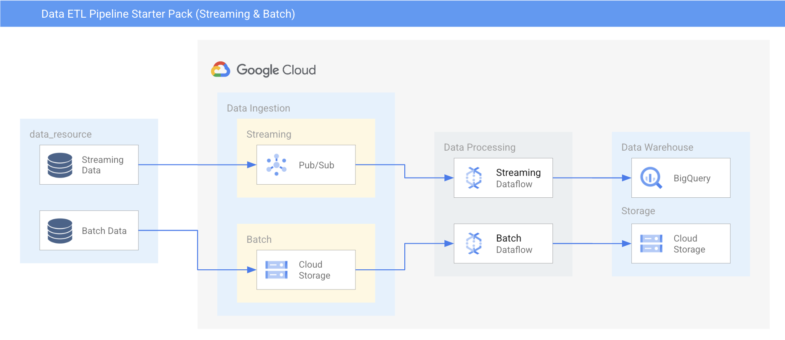

# Data ETL Starter Pack

## Table of Contents
1. [Summary](#summary)
2. [Org Policies](#organizational-policies)
3. [Output Resources](#organizational-policies)
4. [Data ETL Pipeline Architecture Diagram](#network-diagram)
5. [Product Links](#product-links)
6. [Release Notes](#release-notes)

## Summary
This starter pack deploys both batch and streaming Dataflow jobs 

## Organizational Policies
The following Argolis Default organization policies have been modified:
* compute.vmExternalI (Allow: All)

## Output Resources
* VPC
* Pub/Sub Subscription (To public topic: projects/cymbal-fraudfinder/topics/ff-tx)
* Storage Bucket
* Dataflow Job
    * Batch Job: [running a big data text processing pipeline](https://codelabs.developers.google.com/codelabs/cloud-dataflow-starter#0) 
    * Streaming Job: translating and loading streaming data from Pub/Sub to BigQuery 
* BigQuery dataset 

## Data ETL Pipeline Architecture Diagram

## Product Links
* [VPC](https://cloud.google.com/vpc)
* [Pub/Sub](https://cloud.google.com/pubsub)
* [Cloud Storage](https://cloud.google.com/storage)
* [Dataflow](https://cloud.google.com/dataflow)
* [BigQuery](https://github.com/GoogleCloudPlatform/bigquery)

## Release Notes
* 12/19/22- Inital Release